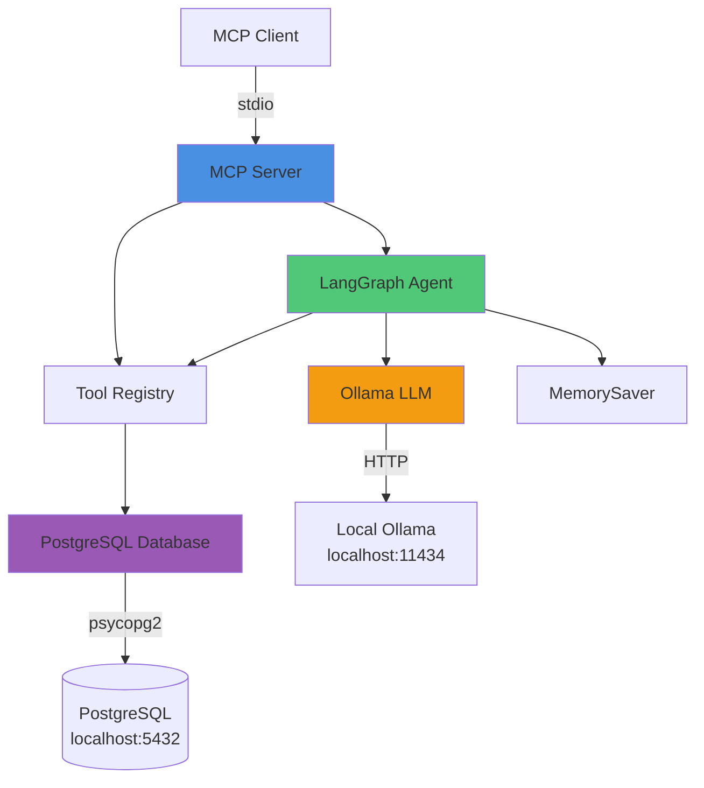
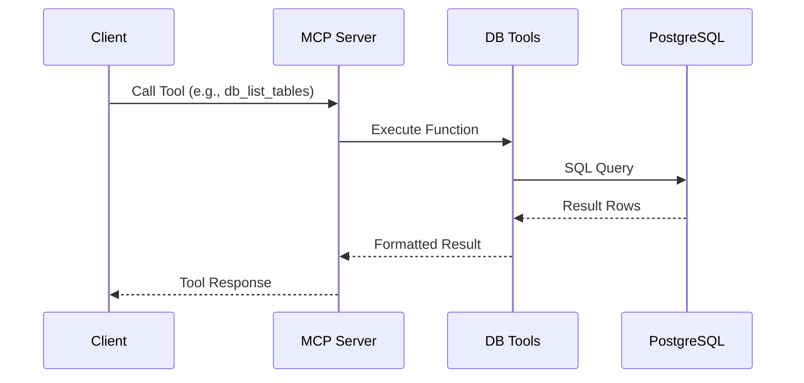
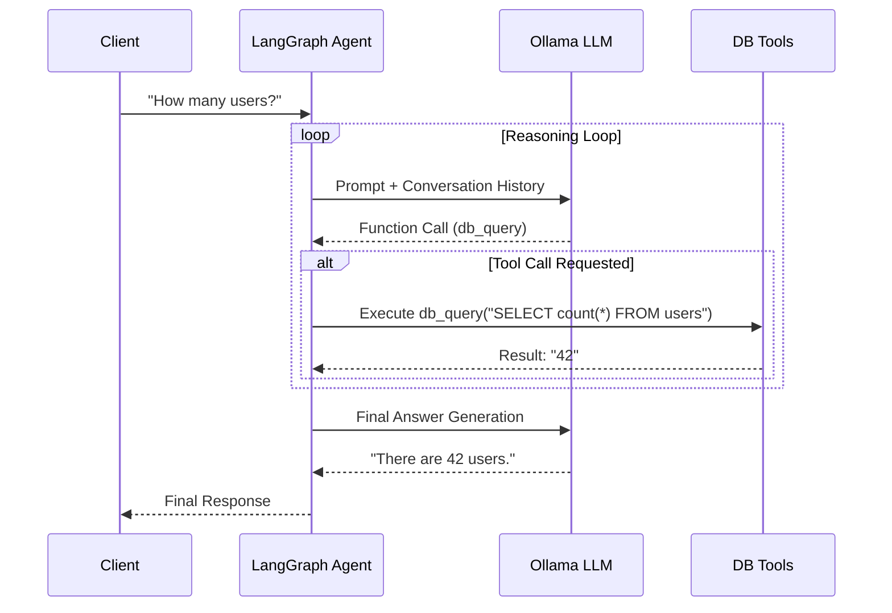
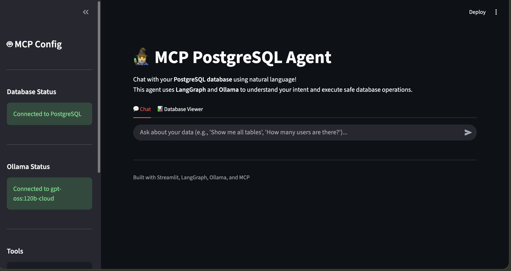
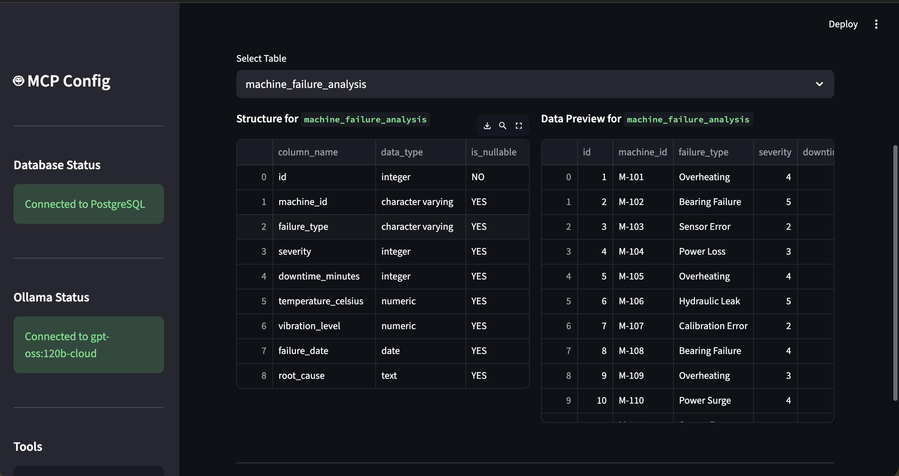
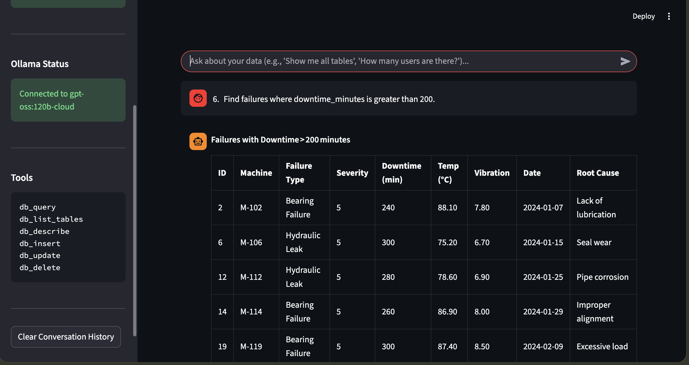
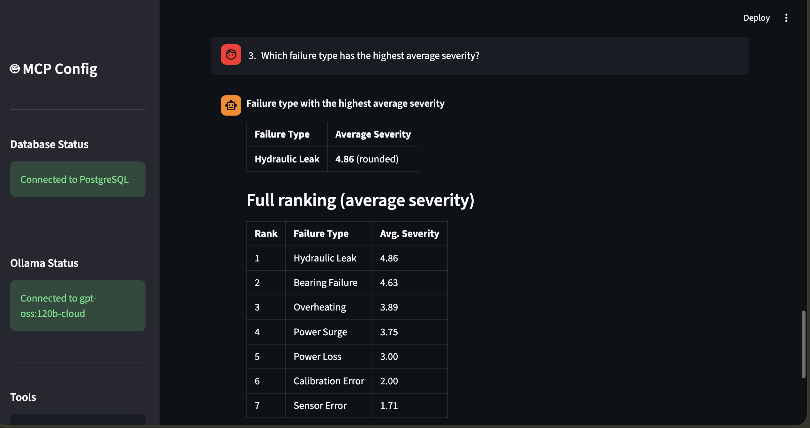

# MCP PostgreSQL Server with LangGraph & Ollama

A Model Context Protocol (MCP) server that integrates PostgreSQL database operations with LangGraph workflow orchestration and remote Ollama LLM inference.

## Features

- 🗄️ **PostgreSQL Integration**: Full CRUD operations via MCP tools
- 🤖 **LangGraph Agent**: Intelligent workflow orchestration with conversation memory
- 🖥️ **Streamlit UI**: User-friendly chat interface and database explorer
- 🧠 **Ollama LLM**: Local endpoint support for `gpt-oss:120b-cloud` model
- 🔧 **MCP Protocol**: Standards-compliant Model Context Protocol implementation
- 💾 **Persistent Memory**: Conversation state management using MemorySaver
- 🛠️ **Tool Binding**: Automatic tool selection and execution by LLM

## Architecture



## Workflows

### 1. Direct Database Tool Execution

When a client requests a specific tool execution (e.g., via MCP protocol):



### 2. Agent-Based Reasoning (LangGraph)

When a client asks a natural language question (e.g., "How many users are active?"):



## Prerequisites

- Python 3.8+
- PostgreSQL 15+ (running in Podman/Docker)
- Local Ollama endpoint with `gpt-oss:120b-cloud` model
- Conda environment `venv`

## Installation

1. **Clone or navigate to the project directory**:
   ```bash
   cd /Users/Downloads/mcp-postgres
   ```

2. **Activate conda environment**:
   ```bash
   conda activate venv
   ```

3. **Install dependencies**:
   ```bash
   pip install -r requirements.txt
   ```

4. **Configure environment** (optional - defaults provided):
   Create a `.env` file:
   ```env
   # PostgreSQL Configuration
   DB_HOST=localhost
   DB_PORT=5432
   DB_NAME=mcpdb
   DB_USER=mcpuser
   DB_PASSWORD=mcppassword
   
   # Ollama Configuration
   OLLAMA_ENDPOINT=http://localhost:11434/
   OLLAMA_LLM_MODEL=gpt-oss:120b-cloud
   
   # LLM Parameters
   LLM_TEMPERATURE=0
   LLM_MAX_TOKENS=1000
   ```

## PostgreSQL Setup

Ensure your PostgreSQL container is running:

```bash
podman run -d \
  --name postgres_mcp \
  -e POSTGRES_DB=mcpdb \
  -e POSTGRES_USER=mcpuser \
  -e POSTGRES_PASSWORD=mcppassword \
  -p 5432:5432 \
  postgres:15

# Verify container is running
podman ps | grep postgres_mcp

# Test connection
podman exec -it postgres_mcp psql -U mcpuser -d mcpdb -c "\dt"
```

## Ollama Setup

Verify Ollama endpoint is accessible and has required models:

```bash
# Check endpoint availability
curl http://localhost:11434/api/tags

# Verify gpt-oss:120b-cloud model exists in response
```

## Usage

### 1. Streamlit UI (New!)

Start the web interface:

```bash
streamlit run streamlit_app.py
```

Features:
- **Chat Interface**: Natural language interaction with your database
- **Data Explorer**: visual table viewer and structure inspection
- **Sidebar status**: Real-time connection checks

### 2. Interactive CLI Chat

Chat directly with the agent from the command line:

```bash
python langgraph_agent.py
```

Features:
- **Natural Language Chat**: Talk to your database
- **Thread Management**: `/thread <id>` to switch conversations
- **Tables View**: `/tables` to see database structure
- **History**: Conversation context is preserved

### 2. Test Database Connection

```bash
conda activate venv
cd /Users/Downloads/mcp-postgres
python test_db_connection.py
```

Expected output:
- ✓ Configuration validated
- ✓ Database connection successful
- ✓ Table creation, insertion, update, delete, query operations

### 3. Test LangGraph Agent

```bash
python test_langgraph.py
```

Expected output:
- ✓ Ollama LLM initialization
- ✓ LangGraph workflow construction
- ✓ Tool binding and execution
- ✓ Conversation memory persistence

### 4. Run Examples

```bash
python example_usage.py
```

Demonstrates:
- Direct database operations
- Natural language queries via agent
- Conversation memory
- Multi-step workflows

### 5. Run MCP Server

```bash
python mcp_postgres_server.py
```

The server runs with stdio transport and awaits MCP protocol commands.

## Available MCP Tools

| Tool Name | Description | Parameters |
|-----------|-------------|------------|
| `db_query` | Execute SQL SELECT query | `query`: SQL string |
| `db_list_tables` | List all database tables | None |
| `db_describe` | Describe table structure | `table_name`: Table name |
| `db_insert` | Insert new record | `table`: Table name<br>`data`: JSON string |
| `db_update` | Update existing record | `table`: Table name<br>`record_id`: Integer<br>`data`: JSON string |
| `db_delete` | Delete record by ID | `table`: Table name<br>`record_id`: Integer |
| `agent_query` | Ask LangGraph agent | `question`: User question<br>`thread_id`: Optional thread ID |

## Visual Examples

### Streamlit Chat Interface

*Natural language interaction with the database using the Streamlit UI.*

### Database Viewer

*Exploring table structure and data content visually.*

### CLI Interaction

*Interactive command-line chat session.*

### Agent Reasoning

*Agent explaining its thought process and results.*
## Example video

## Code Structure

```
mcp-postgres/
├── config.py                  # Configuration management
├── db_tools.py                # PostgreSQL operations
├── langgraph_agent.py         # LangGraph workflow with Ollama
├── streamlit_app.py           # Streamlit web interface
├── mcp_postgres_server.py     # MCP server implementation
├── test_db_connection.py      # Database connection tests
├── test_langgraph.py          # LangGraph agent tests
├── example_usage.py           # End-to-end usage examples
├── requirements.txt           # Python dependencies
└── README.md                  # This file
```

## Key Components

### Configuration (`config.py`)
- Environment variable management
- Default values for PostgreSQL and Ollama settings
- Configuration validation

### Database Tools (`db_tools.py`)
- Connection pooling with context managers
- CRUD operations: query, insert, update, delete
- Table introspection: list_tables, describe_table
- Connection testing

### LangGraph Agent (`langgraph_agent.py`)
- State management with `add_messages`
- Ollama LLM initialization with remote endpoint
- Tool binding for database operations
- Graph construction with conditional routing
- MemorySaver for conversation persistence

### MCP Server (`mcp_postgres_server.py`)
- MCP protocol implementation
- Tool registration and execution handlers
- stdio transport for client communication
- Integration with LangGraph agent

## Development Notes

### Formatting Standards
All Python files follow strict formatting requirements:
- File headers with comment blocks
- Section markers with `print("=" * 40)`
- Import status prints after each import/connection
- Process markers: `#===============[ process_name ]==========`
- Type hints per PEP standards
- Docstrings for all functions and classes
- End-of-file EXPLANATION sections

### Error Handling
- All database operations wrapped in try-except blocks
- Connection context managers ensure proper cleanup
- Detailed error messages with print statements
- Graceful degradation when services unavailable

## Troubleshooting

### PostgreSQL Connection Issues
```bash
# Check container status
podman ps -a | grep postgres_mcp

# Restart container if needed
podman restart postgres_mcp

# Check logs
podman logs postgres_mcp
```

### Ollama Connection Issues
```bash
# Verify endpoint accessibility
curl http://localhost:11434/api/tags

# Check model availability
curl http://localhost:11434/api/show -d '{"name": "gpt-oss:120b-cloud"}'
```

### Import Errors
```bash
# Ensure conda environment is active
conda activate venv

# Reinstall dependencies
pip install -r requirements.txt --upgrade
```

## License

This project is provided as-is for demonstration purposes.

## Contributing

Contributions welcome! Please ensure all code follows the strict formatting standards outlined in the development notes.
